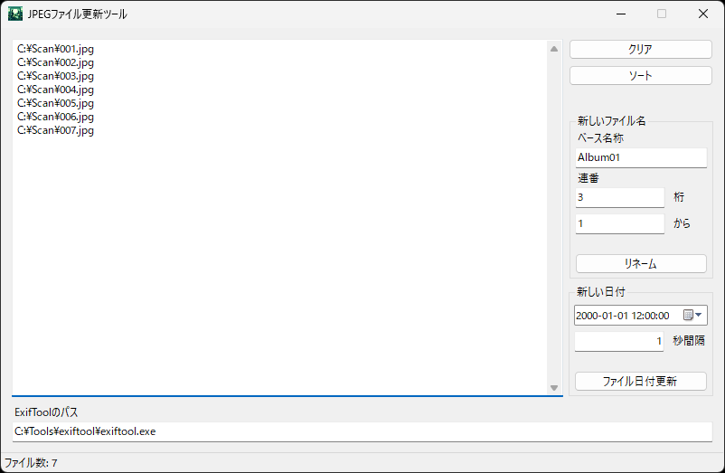

# JPEGファイル更新ツール

## 開発時の注意点

Visual Studio を管理者として起動すると、デバッグ時にフォームへのファイルドラッグ＆ドロップができないため、一般ユーザー権限で Visual Studio を起動することを推奨します。

- [C# WinForms DragEnter never fires - Stack Overflow](https://stackoverflow.com/questions/8776719/c-sharp-winforms-dragenter-never-fires)
